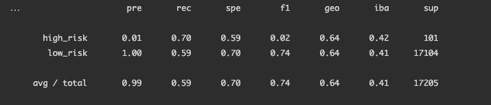
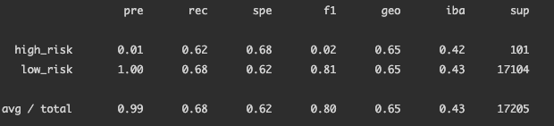
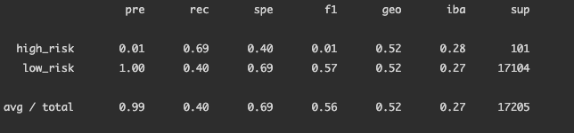
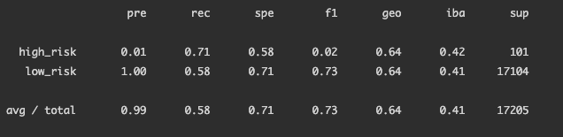
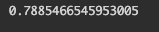
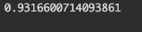
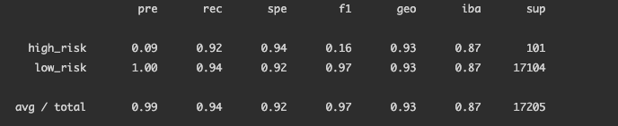

# Credit Risk Analysis

## Overview of the analysis

The objective of this analysis is to apply imbalanced learning techniques to predict credit card risk using machine learing. For this we will undersample, oversample and use a combinatorial approach to predict credit card risk. 

After we're done with this, we will compare different approaches and we will make a recommendation on whether they should be used or not to tackle this problem.

## Results

### Oversampling
1 Naive Random Oversampling 
  - Balanced Accuracy Score

  - Imbalanced Classification Report 

2 SMOTE
  - Balanced Accuracy Score

  - Imbalanced Classification Report 

3 Cluster Centroids
  - Balanced Accuracy Score

  - Imbalanced Classification Report 

4 SMOTEENN
  - Balanced Accuracy Score

  - Imbalanced Classification Report

5 Balanced Random Forest
  - Balanced Accuracy Score

  - Imbalanced Classification Report 

6 EasyEnsembleClassifier
  - Balanced Accuracy Score

  - Imbalanced Classification Report

 
## Summary

As we can observe, the results of all of our models are quite accurate ( above 50% in balance ) but they are not very precise ( very low precision, specifically on high_risk credits ). This means that we are not flagging high risk credits appropriately and this models shouldn't be used for this specific purpose. We can also observe that our f1 scores are pretty low across the board for high_risk transactions which are very sensitive for this type of analysis, hence we would suggest looking for other alternatives to model this type of problem. 
