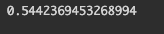
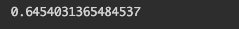

# Credit Risk Analysis

## Overview of the analysis

The objective of this analysis is to apply imbalanced learning techniques to predict credit card risk using machine learing. For this we will undersample, oversample and use a combinatorial approach to predict credit card risk. 

After we're done with this, we will compare different approaches and we will make a recommendation on whether they should be used or not to tackle this problem.

## Results

### Oversampling
1 Naive Random Oversampling 
  - Balanced Accuracy Score

  - Imbalanced Classification Report 

2 SMOTE
  - Balanced Accuracy Score

  - Imbalanced Classification Report 

3 Cluster Centroids
  - Balanced Accuracy Score

  - Imbalanced Classification Report 

4 SMOTEENN
  - Balanced Accuracy Score

  - Imbalanced Classification Report

5 Balanced Random Forest
  - Balanced Accuracy Score

  - Imbalanced Classification Report 

6 EasyEnsembleClassifier
  - Balanced Accuracy Score

  - Imbalanced Classification Report

 
## Summary
